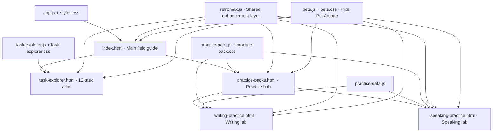

# TOEFL iBT 2026 Complete Guide

<p align="center">
  
</p>

<p align="center">
  A local-first, research-backed TOEFL iBT field guide, task atlas, and interactive practice suite for the format introduced on January 21, 2026.
</p>

<p align="center">
  
  
  
  
  
</p>

> [!IMPORTANT]
> This is an independent study project. It is not produced, sponsored, or endorsed by ETS. TOEFL and TOEFL iBT are registered trademarks of ETS.

## Overview

The project turns the updated TOEFL iBT into an explorable learning system rather than a collection of static notes. It combines:

- A comprehensive format and scoring field guide.
- A dedicated 12-task explorer with official examples and source links.
- Color-coded Writing frameworks and annotated original models.
- Independent Speaking response engines and Listen & Repeat chunk training.
- Full Writing and Speaking practice packs with timers, drafts, recording, playback, and progress tracking.
- Browser-local highlighting, comments, checklists, and study progress.
- A persistent Pixel Pet Arcade with six original pets, three dens, toys, naps, dragging, and multi-pet interactions.
- A responsive maximalist-retro interface that works without a backend or build pipeline.

## Table of contents

- [Project pages](#project-pages)
- [2026 format snapshot](#2026-format-snapshot)
- [Core features](#core-features)
- [Pixel Pet Arcade](#pixel-pet-arcade)
- [Practice inventory](#practice-inventory)
- [Architecture](#architecture)
- [Getting started](#getting-started)
- [Deploying](#deploying)
- [Browser capabilities](#browser-capabilities)
- [Local data and privacy](#local-data-and-privacy)
- [Content provenance](#content-provenance)
- [Accessibility and responsive design](#accessibility-and-responsive-design)
- [Validation](#validation)
- [Project structure](#project-structure)
- [Known limitations](#known-limitations)
- [Contributing](#contributing)
- [Legal and licensing](#legal-and-licensing)

## Project pages

| Page | Role | Highlights |
|---|---|---|
| [`index.html`](index.html) | Main field guide | Format overview, adaptive test explanation, scoring, section explorer, study plans, test-day guidance, annotations, and checklists |
| [`task-explorer.html`](task-explorer.html) | Complete Task Atlas | All 12 task types, module routes, task mechanics, official examples, strategy workflows, common traps, highlighted Writing models, and Speaking scripts |
| [`practice-packs.html`](practice-packs.html) | Practice hub | Entry point for the standalone Writing and Speaking practice environments |
| [`writing-practice.html`](writing-practice.html) | Writing lab | Build a Sentence, Email, and Academic Discussion practice with saved drafts, timers, word counts, and sample answers |
| [`speaking-practice.html`](speaking-practice.html) | Speaking lab | Listen & Repeat playback, microphone recording, optional speech-recognition feedback, interview timers, and completion tracking |

## 2026 format snapshot

| Section | Task families | Public base items | Public base time | Delivery |
|---|---|---:|---:|---|
| Reading | Complete the Words; Read in Daily Life; Read an Academic Passage | 50* | ~30 min* | Two-stage adaptive |
| Listening | Choose a Response; Conversation; Announcement; Academic Talk | 47* | ~29 min* | Two-stage adaptive |
| Writing | Build a Sentence; Write an Email; Academic Discussion | 12 | 23 min | Linear |
| Speaking | Listen & Repeat; Take an Interview | 11 | 8 min | Linear |
| **Public base total** | **12 task types** | **120*** | **~90 min*** | Allow roughly two hours with directions and transitions |

`*` Reading and Listening are adaptive. Delivered item counts and timing can vary, and some delivered items may be unscored.

The expanded in-project matrix goes beyond this summary by mapping each section to its routing logic, item anatomy, response mode, timing, and blueprint raw-point construction.

## Core features

### Complete Task Atlas

The dedicated explorer provides a consistent profile for every task:

- Official task mechanics and representative ETS excerpts or prompt themes.
- Section filtering and direct links from the main guide.
- A practical, repeatable workflow for solving or answering the task.
- The ability being measured and the most common avoidable traps.
- Module and route context for adaptive Reading and Listening.
- Direct links to the supporting ETS or test-preparation source.

Official material, adapted prompts, and original practice responses are labeled separately so the reader can distinguish test facts from strategy guidance.

### Writing studio

The Writing studio contains five flexible, color-annotated frameworks:

1. Email: problem and request.
2. Email: status and clarification.
3. Email: peer coordination.
4. Academic Discussion: agree and extend.
5. Academic Discussion: qualify and counter.

Each framework includes a prompt, blank response skeleton, complete original model, semantic color key, move-by-move explanation, word count, and adaptation notes. The landlord-maintenance model follows the user-supplied visual reference while the other scenarios are based on current ETS task shapes.

The colors represent rhetorical jobs—not sentences to memorize:

| Writing color role | Function |
|---|---|
| Greeting / position | Establish the recipient relationship or answer the question |
| Purpose / connection | State why the writer is responding |
| Detail | Complete a specific prompt requirement |
| Impact / evidence | Explain why the detail matters |
| Request / qualification | Ask for action or add nuance |
| Close | Finish naturally without introducing a new idea |

### Speaking studio

The Speaking studio provides four lightweight response engines:

- Opinion or preference.
- Experience or memory.
- Routine or lifestyle.
- Solution or prediction.

Every engine includes an interview question, a four-move plan, a highlighted original response, and delivery coaching. A built-in text-to-speech control can play models aloud when the browser supports the Web Speech API.

The Listen & Repeat lab adds chunk visualization and recall mode. It emphasizes meaning groups, stressed content words, grammatical links, original order, and continued delivery after a minor memory lapse.

### Highlighting and annotation tools

Across the guide and practice pages, `retromax.js` and the annotation systems provide:

- Text highlighting and comments.
- Clickable saved highlights.
- JSON note export where available.
- Reduced-motion support.
- Keyboard-visible focus states.

### Pixel Pet Arcade

Every page loads the same dependency-free `pets.js` and `pets.css` playground. It includes:

- Six original pixel pets: three cats and three dogs with distinct silhouettes and palettes.
- A three-pet maximum with a persistent roster and cross-page positions.
- Separate cat-ball and dog-bone play loops, click reactions, zoomies, roaming, naps, and wake-up states.
- Pair and three-pet social scenes, including nose boops, paw handshakes, bone-tug, and tiny parades.
- Three draggable shared-den skins with lit sleeper windows.
- Pointer dragging, keyboard movement, direct action controls, quiet motion, autoplay, and a hide-world option.

Pet choices and settings stay in browser storage. The playground does not use external image assets, tracking, or a backend.

## Practice inventory

The structured practice dataset currently contains:

| Activity | Inventory |
|---|---:|
| Build a Sentence | 30 items |
| Write an Email | 5 prompts |
| Academic Discussion | 5 prompts |
| Listen & Repeat | 5 scenarios / 35 sentences |
| Take an Interview | 5 scenarios / 20 questions |

Practice content is original and designed to match the current task shapes. It is not official ETS test material and should not be presented as scored ETS work.

## Architecture



### Technical profile

- Static HTML, CSS, and browser JavaScript.
- No server-side application, database, authentication, package manager, or build command.
- The main `app.js` is a prebundled React application that includes its runtime.
- The Task Atlas and practice packs use standalone browser JavaScript.
- Data is stored in `practice-data.js` and loaded directly into the page.
- User state is stored in `localStorage` or `sessionStorage`.
- All navigation is compatible with static hosting.

## Getting started

### Option 1: open the files directly

Open [`index.html`](index.html) in a modern browser. Navigation, reading tools, templates, and most practice features work from the filesystem.

### Option 2: serve the folder locally

Localhost is recommended for microphone access, recording, and browser speech-recognition features.

From the project directory, run one of the following:

```bash
# Python
python -m http.server 4173

# Windows Python launcher
py -m http.server 4173

# Node.js via the serve package
npx serve . -l 4173
```

Then open:

```text
http://localhost:4173/
```

No dependency installation is required for the site itself.

## Deploying

The project can be hosted on GitHub Pages or any static host.

Use these deployment settings:

| Setting | Value |
|---|---|
| Build command | None |
| Publish directory | Repository root |
| Entry file | `index.html` |
| Server functions | None |
| Required environment variables | None |

For complete microphone behavior, deploy over HTTPS. Most static hosting providers—including GitHub Pages—serve published projects over HTTPS.

## Browser capabilities

The application feature-detects browser APIs and keeps the core reading experience usable when an optional capability is unavailable.

| Capability | Used for | Fallback behavior |
|---|---|---|
| `localStorage` | Drafts, annotations, progress, preferences | State does not persist if storage is blocked |
| CSS Custom Highlight API | Persistent in-page text highlights | Notes remain available, but painted ranges may be limited |
| Web Speech synthesis | Model and prompt playback | Playback controls report that audio is unavailable |
| `MediaRecorder` | Speaking response recording | Recording is unavailable; written practice remains usable |
| Speech Recognition API | Optional repetition transcript and similarity feedback | Learners can record and self-review without automated transcription |
| Clipboard API | Copying blank response frameworks | Framework text can be selected manually |

Chrome or Edge on localhost/HTTPS generally provides the broadest combination of speech and microphone features. Exact API availability still depends on browser version, operating system, permissions, and organization policy.

## Local data and privacy

The project has no application backend and does not upload study data itself.

| Local data | Storage behavior |
|---|---|
| Reading preferences | Saved in browser `localStorage` |
| Highlights and comments | Saved per browser and, on practice pages, per path |
| Writing drafts | Saved per prompt in `localStorage` |
| Sentence, repetition, and interview progress | Saved in `localStorage` |
| Active prompt position | Some navigation state uses `sessionStorage` |
| Pet roster, den, settings, and positions | Saved in `localStorage` under one versioned pet-world key |
| Microphone recordings | Kept as in-memory browser object URLs for the current session |

> [!NOTE]
> The application does not transmit recordings. Browser-provided speech recognition may use a platform or vendor speech service; that processing behavior is controlled by the browser, not this project.

Clearing the site's browser storage removes saved preferences, drafts, annotations, pet-world choices, and progress. There is currently no cross-device synchronization.

## Content provenance

Format claims and task mechanics were last checked on **August 14, 2026** against primary ETS material:

- [ETS TOEFL iBT content overview](https://www.ets.org/toefl/test-takers/ibt/about/content.html)
- [TOEFL iBT Test Specifications — 2026](https://www.ets.org/content/dam/ets-org/pdfs/toefl/toefl-ibt-test-specifications-2026.pdf)
- [Official Full-Length Practice Test 1](https://www.ets.org/content/dam/ets-org/pdfs/toefl/toefl-ibt-full-length-practice-test-1.pdf)
- [Updated Writing lesson plan](https://www.ets.org/content/dam/ets-org/pdfs/toefl/toefl-ibt-lesson-plan-writing.pdf)
- [Updated Speaking lesson plan](https://www.ets.org/content/dam/ets-org/pdfs/toefl/toefl-ibt-lesson-plan-speaking.pdf)
- [Writing scoring guides](https://www.ets.org/content/dam/ets-org/pdfs/toefl/writing-rubrics.pdf)
- [Speaking scoring guides](https://www.ets.org/content/dam/ets-org/pdfs/toefl/speaking-rubrics.pdf)

The strategy layer was also informed by test-preparation explanations such as:

- [Magoosh: TOEFL Write an Email](https://magoosh.com/toefl/toefl-write-an-email/)
- [TOEFL Resources: Writing templates](https://www.toeflresources.com/writing-section/toefl-writing-templates/)
- [TOEFL Resources: Speaking templates](https://www.toeflresources.com/speaking-section/toefl-speaking-templates/)

Templates are study frameworks, not ETS requirements or score guarantees. Full response models are original unless explicitly identified otherwise.

## Accessibility and responsive design

The interface includes:

- Semantic page landmarks and section headings.
- Accessible names for interactive controls.
- Visible keyboard focus styling.
- Reduced-motion behavior through `prefers-reduced-motion`.
- Keyboard-operable pets and den controls, plus a labeled modal pet manager.
- High-contrast tactile cards and large response highlights.
- Internal horizontal scrolling for wide data tables on small screens.
- Responsive layouts tested at desktop and 390 px mobile width.

This project has not undergone a formal WCAG conformance audit. Accessibility improvements and assistive-technology testing are welcome.

## Validation

The current release has been checked for:

- JavaScript syntax across `app.js`, `task-explorer.js`, `practice-pack.js`, `retromax.js`, and `pets.js`.
- Resolution of all local HTML `href` and `src` targets.
- Rendering at desktop and mobile widths.
- Page-level horizontal overflow.
- Dark-panel text contrast.
- Task filters and task-detail selection.
- Writing and Speaking template switching.
- Pet persistence, the three-pet cap, separate species toys, sleep/wake, drag, keyboard, quiet-motion, and all-page singleton mounting.
- Fresh browser console warnings and errors.

Useful syntax checks:

```bash
node --check app.js
node --check task-explorer.js
node --check retromax.js
node --check practice-pack.js
node --check practice-data.js
node --check pets.js
```

Because there is no automated test suite yet, content edits should also receive a manual browser pass at desktop and mobile widths.

## Project structure

```text
TOEFL-2026/
├── index.html                 # Main application shell
├── app.js                     # Prebundled React field-guide application
├── styles.css                 # Main guide and retro design system
├── task-explorer.html         # Complete 12-task atlas
├── task-explorer.js           # Atlas data, filters, templates, and scripts
├── task-explorer.css          # Atlas-specific responsive styling
├── practice-packs.html        # Practice hub
├── writing-practice.html      # Writing practice interface
├── speaking-practice.html     # Speaking practice interface
├── practice-data.js           # Structured Writing and Speaking content
├── practice-pack.js           # Practice interactions and local persistence
├── practice-pack.css          # Shared practice-page styling
├── retromax.js                # Shared visual, annotation, and community enhancements
├── pets.js                     # Persistent pet roster, state machine, and interactions
├── pets.css                    # Pixel models, den UI, manager, and animations
├── assets/
│   ├── retro-hero-main.png
│   ├── retro-hero-writing.png
│   ├── retro-hero-speaking.png
│   └── speaking-page-*-visual.png
├── README.md                  # GitHub project documentation
└── README.txt                 # Legacy standalone notes
```

## Known limitations

- The main React application is distributed only as the compiled `app.js`; the original component source and build configuration are not included.
- Speech synthesis, recognition, and recording behavior differs across browsers and operating systems.
- User data is browser-local and has no account, backup, or synchronization service.
- There is no automated unit, integration, accessibility, or end-to-end test suite.
- Source URLs and TOEFL specifications can change; factual claims should be periodically reverified.
- Large visual assets increase repository size and initial image-transfer cost.

## Contributing

Contributions should preserve three project rules:

1. **Official facts first.** Verify timing, counts, scoring, and task mechanics against current ETS sources.
2. **Label provenance.** Clearly distinguish official excerpts, adapted prompts, test-prep strategy, and original practice content.
3. **Keep it local-first.** Do not add tracking, remote storage, or account requirements without documenting the privacy change.

Suggested workflow:

1. Make a focused change.
2. Run the JavaScript syntax checks.
3. Confirm every local link and asset resolves.
4. Test the affected interactions with keyboard and pointer input.
5. Check desktop and mobile layouts.
6. Update this README when page structure, data counts, browser requirements, or content sources change.

When adding a new practice item, prefer specific, realistic details and natural language over reusable memorized filler. Never label an original answer as an official ETS response.

## Legal and licensing

No open-source license is currently included in this repository. Until a license is added, normal copyright restrictions apply to the project code and original content.

TOEFL and TOEFL iBT are registered trademarks of ETS. Linked ETS documents and any short referenced excerpts remain the property of their respective rights holders. Review the provenance and redistribution rights of source-derived visual assets before publishing a public fork.

---

<p align="center">
  <strong>Study the task, understand the move, then make the language your own.</strong>
</p>
